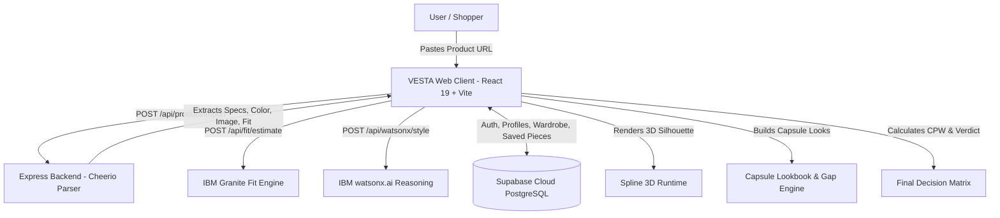

<p align="center">
  
</p>

<p align="center">
  <strong>Style Beyond Limits — AI Fashion Intelligence & Silhouette Decision Platform</strong>
</p>

<p align="center">
  
  
  
  
  
  
  
</p>

---

## ✦ Overview

**VESTA** is an AI-powered fashion decision engine designed to transform online clothing shopping. Rather than relying on guesswork, static photos, and disjointed return policies, VESTA empowers shoppers to **understand, fit, style, match, and decide** before they ever reach checkout.

By synthesizing **real-time retailer web scraping**, **IBM Granite AI reasoning**, **interactive 3D mannequin visualization**, and **deterministic wardrobe gap modeling**, VESTA answers the ultimate shopping question:
> *"Will this actually fit my body, work with my wardrobe, and justify its cost?"*

---

## ✦ Key Features

### 01 / Live Retailer Ingestion & Garment Understanding
* **Universal URL Ingestion**: Paste product links from live retailers (Uniqlo, Zara, H&M, and more).
* **Automated Metadata Extraction**: Cheerio-powered server parser extracts garment title, high-resolution product imagery, descriptions, fabric details, and cut characteristics.
* **Intelligent Retailer Color & Category Detection**: Automatically maps retailer codes (e.g., Uniqlo `COL68` $\rightarrow$ `Blue`) and categorizes garments into specialized silhouettes (`T-Shirt`, `Shirt`, `Hoodie`, `Jacket`, `Trousers`).
* **Interactive Attribute Quick-Pills**: On-the-fly override buttons for Colour and Category that instantly update all downstream workspaces in real time.

### 02 / IBM Granite Fit Estimation
* **Anatomical Body Matching**: Compares the user's 6 anatomical body measurements (**Height**, **Chest**, **Waist**, **Hips**, **Shoulder Width**, **Inseam**) against detected garment specifications.
* **Personalized Fit Preferences**: Tailored calculations for *Regular Fit*, *Slim Fit*, *Relaxed Fit*, or *Oversized*.
* **Fit Verdict & Match Score**: Outputs a numeric match percentage (0–100%), suitability badge (*Optimal Match*, *Close Fit*, *Size Up Recommended*), and critical area dimension analysis.

### 03 / Style Intelligence (watsonx.ai)
* **Curated Fashion Reasoning**: Powered by IBM Granite via watsonx.ai.
* **Occasion & Palette Coordination**: Structured advice on palette harmony, layering potential, and silhouette balance.

### 04 / Interactive 3D Spline Mannequin
* **Real-time 3D Silhouette**: Integrated interactive Spline mannequin scene via `@splinetool/react-spline`.
* **Dynamic Viewport**: Interactive 360° rotation and zoom alongside garment specification cards to visualize fit proportions in space.

### 05 / 4-Piece Capsule Lookbook & Occasion Modes
* **Dynamic Capsule Builder**:
  * **Slot 01 (Core Garment)**: The imported item with photo and detailed silhouette note (e.g., `Regular Fit · Blue T-Shirt`).
  * **Slot 02 (Complementary Bottom)**: Pairs with items in your wardrobe or suggests capsule staples.
  * **Slot 03 (Footwear Anchor)**: Selects grounding footwear (leather derbies, low-tops, Chelsea boots).
  * **Slot 04 (Accent & Layer)**: Curates complementary overshirts, totes, or minimalist accents.
* **3 Occasion Modes**:
  * ☀️ **Casual Daywear**
  * 💼 **Smart Casual / Creative Work**
  * 🍸 **Evening / Night Out**
* **Shuffle & Save**: One-click pairing shuffle and saving directly to your personal VESTA Capsule collection.
* **Capsule Gap Filler Banner**: Identifies wardrobe duplicates vs. unfilled roles (e.g., *"✨ CAPSULE GAP FILLER: Fills an unfilled role in your wardrobe collection. You have no direct duplicate for this blue t-shirt."*).

### 06 / Digital Wardrobe & Compatibility Engine
* **Closet Management**: Digital manager to store and organize owned pieces with category tags.
* **Wardrobe Match Score (0–95%)**: Evaluates whether a prospective purchase complements or clashes with existing clothing.

### 07 / Cost-Per-Wear & Decision Matrix
* **Cost-Per-Wear (CPW) Calculator**: Dynamic price input and monthly wear frequency slider estimating annual wears and true cost per wear ($/wear).
* **Composite Purchase Verdict**:
  * **PROCEED WITH CONFIDENCE (BUY)**
  * **PROCEED WITH CAUTION**
  * **PASS**
* **Pre-Checkout Verification Checklist**: Interactive 4-point checklist covering Occasion Alignment, Silhouette Confidence, Palette Versatility, and CPW Justification.

### 08 / Compare & What-If Scenarios
* **Side-by-Side Comparison**: Evaluate two pieces directly to compare fit, style, and value metrics.
* **What-If Color Shift**: Simulate how shifting to an alternative color (Black, Navy, Olive, Cream) impacts wardrobe versatility and score.

---

## ✦ System Architecture



---

## ✦ Tech Stack

| Layer | Technology |
| :--- | :--- |
| **Frontend Framework** | React 19, Vite |
| **Styling & Motion** | Vanilla CSS (Luxury Editorial Design System), Framer Motion |
| **3D Graphics** | Spline (`@splinetool/react-spline`, `@splinetool/runtime`) |
| **Icons** | Lucide React |
| **Backend & Scraping** | Node.js, Express 5, Cheerio, CORS |
| **AI & LLM** | IBM Granite via watsonx.ai |
| **Database & Auth** | Supabase (PostgreSQL, Row Level Security, Auth) |

---

## ✦ Project Structure

```
VESTA/
├── public/
│   ├── demo/                  # Demo media assets
│   ├── vesta-logo.png         # Transparent brand logo
│   ├── vesta-logo-white.png   # Dark-mode / dark-surface logo
│   └── favicon.svg            # Browser tab favicon
├── server/
│   ├── server.js              # Express API & Cheerio product scraper
│   └── watsonx.js             # IBM Granite watsonx.ai integration
├── src/
│   ├── assets/                # Static image assets
│   ├── components/
│   │   └── SplineMannequin.jsx # 3D Spline interactive mannequin
│   ├── App.css                # Luxury fashion design system
│   ├── App.jsx                # Main VESTA application & workspaces
│   ├── index.css              # Typography & baseline styling
│   ├── main.jsx               # React DOM root entry
│   └── supabaseClient.js      # Supabase cloud client initialization
├── .env.example               # Environment variable templates
├── eslint.config.js           # ESLint configuration
├── index.html                 # HTML shell & SEO metadata
├── package.json               # Dependencies & build scripts
└── vite.config.js             # Vite bundler & API proxy configuration
```

---

## ✦ Getting Started

### 1. Prerequisites
* **Node.js**: v18.0.0 or later
* **npm**: v9.0.0 or later
* A free **Supabase** account ([supabase.com](https://supabase.com))
* (Optional) **IBM Cloud watsonx.ai** credentials for live Granite inference

### 2. Clone the Repository
```bash
git clone https://github.com/GaikwadAtharva/VESTA.git
cd VESTA
```

### 3. Install Dependencies
```bash
npm install
```

### 4. Configure Environment Variables
Copy the `.env.example` file to `.env`:
```bash
cp .env.example .env
```
Fill in your credentials:
```env
# Supabase Configuration
VITE_SUPABASE_URL=https://your-project.supabase.co
VITE_SUPABASE_ANON_KEY=your-supabase-anon-key

# IBM Granite watsonx.ai (Optional for live LLM)
WATSONX_API_KEY=your-ibm-api-key
WATSONX_PROJECT_ID=your-ibm-project-id
WATSONX_URL=https://us-south.ml.cloud.ibm.com

# Backend Server Port
PORT=3001
```

### 5. Run the Application
In separate terminal windows (or concurrently):

**Start the Express Backend:**
```bash
npm run server
# Runs on http://localhost:3001
```

**Start the Vite Frontend:**
```bash
npm run dev
# Runs on http://localhost:5173
```

Open `http://localhost:5173` in your browser to explore VESTA.

### 6. Production Build
```bash
npm run build
npm run preview
```

---

## ✦ On The Horizon (Roadmap)

- [ ] **VESTA Browser Extension**: Sidecar panel activating directly on retailer checkout pages (Zara, Uniqlo, ASOS) for instant pre-buy scoring.
- [ ] **AI Wardrobe Photo Scanner**: Snap photos of your physical closet to automatically categorize cuts, fabric textures, and color palettes into your digital capsule.
- [ ] **Diffusion Virtual Try-On**: Generative diffusion engine that synthesizes photorealistic drapes onto custom 3D mannequin postures or uploaded personal likenesses.

---

## ✦ License & Acknowledgements

* **License**: MIT
* **Domain**: Built under the **Open Innovation** domain for the 24-hour hackathon.
* Developed with passion for merging luxury fashion editorial aesthetics with high-performance agentic intelligence.